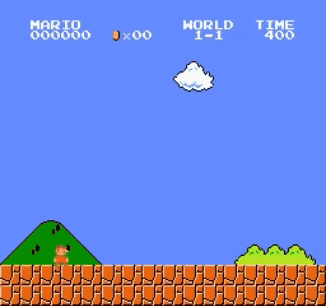
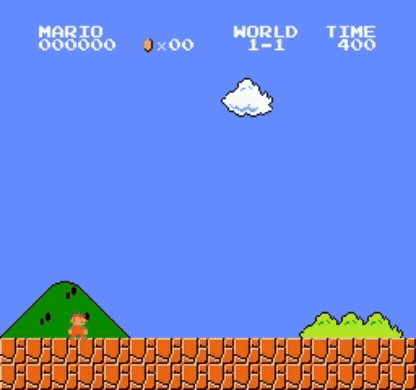
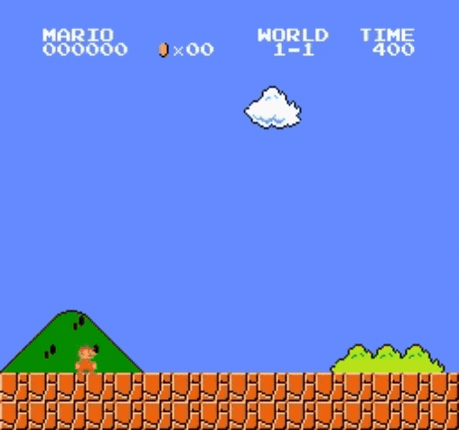
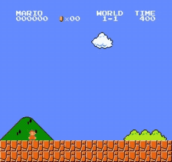

# 🍄 슈퍼마리오 DQN 강화학습

> **Deep Q-Network(DQN)** 으로 슈퍼마리오를 스스로 학습하는 강화학습 딥러닝 과제입니다.

<table>
  <tr>
    <td>📅 <b>기간</b></td>
    <td>2026년 06월 25일 ~ 2026년 07월 01일 (7일)</td>
    <td>👤 <b>팀원</b></td>
    <td>1인 · 김승현</td>
  </tr>
</table>


---

## 📋 과제 개요

| 항목 | 내용 |
|---|---|
| 🎯 **주제** | DQN 에이전트로 슈퍼마리오 자율 플레이 학습 |
| 🤖 **알고리즘** | Deep Q-Network (DQN) |
| 🧠 **신경망** | CNN (Conv2d × 3 + FC × 2) |
| 🎮 **환경** | SuperMarioBros-1-1-v0 (gym-super-mario-bros) |
| 🖥️ **학습 환경** | Google Colab T4 GPU |
| 🚀 **결과물** | 학습 에이전트 플레이 영상 + Streamlit 시연 앱 |

---

## 🔗 바로가기

| 구분 | 링크 |
|---|---|
| 🌐 **Streamlit 시연 앱** | 추후 업데이트 예정 |
| 📓 **Colab 학습 노트북** | [colab/train.ipynb](colab/train.ipynb) |
| 🤖 **학습된 모델** | 추후 GitHub Releases 업로드 예정 |

---

## 🧠 DQN 알고리즘

### 핵심 아이디어

> 게임 화면(픽셀)을 CNN으로 인식하고, 각 행동의 가치(Q값)를 학습해
> 마리오가 스스로 최적의 행동을 선택하도록 훈련합니다.

### 신경망 구조

```
입력: (4, 84, 84) — 4프레임 스택 그레이스케일

Conv2d(4 → 32,  kernel=8, stride=4) → ReLU   # (32, 20, 20)
Conv2d(32 → 64, kernel=4, stride=2) → ReLU   # (64, 9, 9)
Conv2d(64 → 64, kernel=3, stride=1) → ReLU   # (64, 7, 7)

Flatten → Linear(3136 → 512) → ReLU → Linear(512 → 7)

출력: 7개 행동의 Q값 (SIMPLE_MOVEMENT)
```

### DQN 핵심 기법

| 기법 | 역할 |
|---|---|
| **Experience Replay** | 과거 경험을 버퍼에 저장 → 랜덤 샘플링으로 상관관계 제거 |
| **Target Network** | 학습 안정화를 위해 타깃 Q값 계산용 별도 네트워크 유지 |
| **ε-greedy** | 탐험(랜덤)과 활용(최적 행동) 균형 (1.0 → 0.1 점진 감소) |
| **Frame Stack** | 연속 4프레임을 쌓아 움직임 방향 학습 |
| **Frame Skip** | 4프레임마다 행동 결정으로 학습 속도 향상 |

### 학습 흐름

```
게임 화면 → 4프레임 스킵 → 그레이스케일 → 84×84 리사이즈 → 4프레임 스택
     ↓
CNN → Q값 예측 → ε-greedy 행동 선택
     ↓
환경 실행 → 보상 수신 → Replay Buffer 저장
     ↓
배치 샘플링 → 타깃 Q값 계산 → SmoothL1 Loss → 역전파
     ↓
1000 스텝마다 Target Network 업데이트
```

---

## 📁 프로젝트 구조

```
supermario_dl_project/
│
├── 📄 train.py                      # 로컬 학습 실행 진입점
├── 📄 requirements.txt              # Python 의존성
│
├── 📂 colab/
│   └── train.ipynb                  # Google Colab 학습 노트북 (Drive 연동)
│
├── 📂 src/
│   ├── env/wrappers.py              # 환경 전처리 (그레이스케일·리사이즈·프레임스택)
│   ├── model/dqn.py                 # CNN DQN 신경망 구조
│   ├── agent/dqn_agent.py           # DQN 에이전트 (학습·저장·로드)
│   └── utils/
│       ├── replay_buffer.py         # Experience Replay Buffer
│       └── recorder.py              # 에피소드 플레이 영상 녹화 유틸
│
├── 📂 app/
│   └── streamlit_app.py             # Streamlit 시연 웹앱
│
├── 📂 models/                       # 학습된 가중치 (.pth) — git 제외
└── 📂 results/                      # 학습 곡선·플레이 영상 — git 제외
```

---

## 🎮 환경 설정

### 행동 공간 (SIMPLE_MOVEMENT, 7가지)

| 인덱스 | 행동 |
|---|---|
| 0 | 정지 |
| 1 | 오른쪽 이동 |
| 2 | 오른쪽 + 점프 |
| 3 | 오른쪽 + 달리기 |
| 4 | 오른쪽 + 달리기 + 점프 |
| 5 | 왼쪽 이동 |
| 6 | 점프 |

### 하이퍼파라미터

| 파라미터 | 값 |
|---|---|
| 학습률 (lr) | 0.0001 |
| 할인율 (γ) | 0.9 |
| ε 시작 / 종료 | 1.0 / 0.1 |
| ε 감소율 | 0.99999 |
| 배치 크기 | 32 |
| Replay Buffer 크기 | 50,000 |
| Target Network 업데이트 주기 | 1,000 스텝 |
| 프레임 스킵 | 4 |
| 총 학습 에피소드 | 10,000 |
| 체크포인트 저장 주기 | 500 에피소드 |
| 영상·그래프 기록 시점 | EP 0 / 2000 / 5000 / 7000 / 10000 |

---

## 🎬 에피소드별 플레이 영상

> 2배속 · 30초 녹화 | EP 0(무작위) → EP 10000(학습 완료) 순서로 성장 과정 확인

| EP 0 — 무작위 (ε=1.0) | EP 2000 — 초기 학습 |
|:---:|:---:|
|  |  |

| EP 5000 — 중기 학습 | EP 7000 — 후기 학습 |
|:---:|:---:|
|  |  |

| EP 10000 — 최종 결과 |
|:---:|
|  |

---

## 🖥️ Streamlit 시연 앱

**탭 구성:**

| 탭 | 내용 |
|---|---|
| 🎮 **시연** | 학습된 모델 선택 → 에이전트 플레이 영상 실시간 생성 |
| 🎬 **에피소드 비교** | EP 0/2000/5000/7000/10000 플레이 영상 비교 (무작위 → 학습 성장 과정) |
| 📈 **학습 곡선** | 에피소드별 보상 변화 그래프 |
| 🧠 **모델 구조** | CNN 구조 + 하이퍼파라미터 요약 |

---

## ⚙️ 실행 방법

### 1️⃣ 의존성 설치

```bash
pip install -r requirements.txt
```

### 2️⃣ Google Colab 학습 (권장)

1. `colab/train.ipynb` 을 Colab에 업로드
2. 런타임 → **T4 GPU** 선택
3. **GitHub 클론 셀**에서 `GITHUB_REPO` 주소 수정
4. **TensorBoard 셀** 먼저 실행 → 실시간 모니터링 창 열림
5. **학습 실행 셀** 실행 → 모델·영상·그래프가 Google Drive에 자동 저장

```
세션 끊긴 후 이어서 학습:
  CHECKPOINT_PATH = f'{DRIVE_PATH}/models/mario_ep500.pth'  # 원하는 에피소드
  → 1번 셀부터 재실행
```

### 3️⃣ 로컬 학습 (선택)

```bash
python train.py
```

### 4️⃣ Streamlit 시연 앱 실행

```bash
# 학습된 모델(.pth)을 models/ 폴더에 넣은 후 실행
streamlit run app/streamlit_app.py
```

---

## 🗺️ 전체 파이프라인

```
🎮 SuperMarioBros-1-1-v0 환경
     ↓
🔧 전처리 (src/env/wrappers.py)
   4프레임 스킵 → 그레이스케일 → 84×84 리사이즈 → 4프레임 스택
     ↓
🧠 DQN 학습 (Google Colab T4 GPU)
   CNN Policy Net + Target Net + Replay Buffer
   500 에피소드마다 Google Drive에 체크포인트 저장
     ↓
📡 TensorBoard 실시간 모니터링
   보상·epsilon·학습 스텝 실시간 확인
     ↓
📊 결과 분석
   학습 곡선 (보상 변화) + 플레이 영상 생성
     ↓
🌐 Streamlit 시연 앱
   모델 선택 → 에이전트 플레이 영상 + 학습 곡선 + 모델 구조
```

---

## ✅ 진행 현황

- [x] 프로젝트 구조 설계
- [x] 환경 전처리 파이프라인 구현 (`src/env/wrappers.py`)
- [x] CNN DQN 신경망 구현 (`src/model/dqn.py`)
- [x] DQN 에이전트 구현 (`src/agent/dqn_agent.py`)
- [x] Experience Replay Buffer 구현 (`src/utils/replay_buffer.py`)
- [x] 학습 스크립트 구현 (`train.py`)
- [x] Google Colab 학습 노트북 (`colab/train.ipynb`)
- [x] 영상 녹화 유틸 구현 (`src/utils/recorder.py`)
- [x] Streamlit 시연 앱 4탭 구성 (`app/streamlit_app.py`)
- [x] Colab 환경 호환성 트러블슈팅 (numpy 2.0 · gym 0.26 · 영상 깨짐 수정)
- [x] TensorBoard 실시간 모니터링 연동
- [x] 체크포인트 그래프 자동 저장 (EP 0/2000/5000/7000/10000)
- [ ] Colab 학습 실행 (진행 중 — 10,000 에피소드)
- [ ] 학습 결과 분석 및 곡선 시각화
- [ ] 학습된 모델 GitHub Releases 업로드
