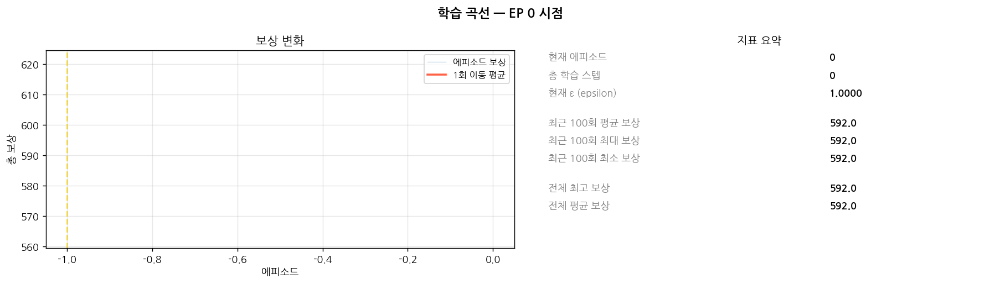
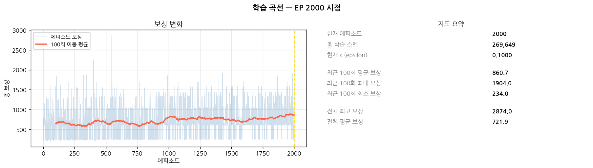
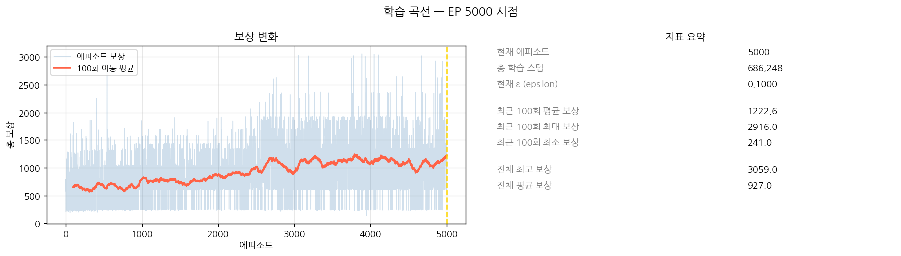
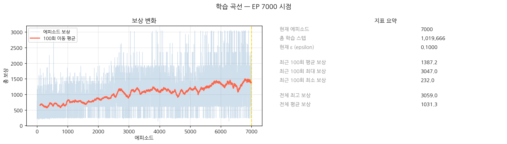
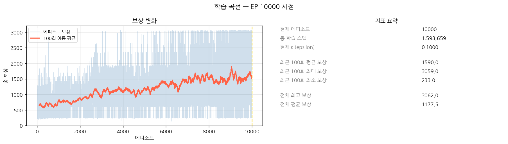
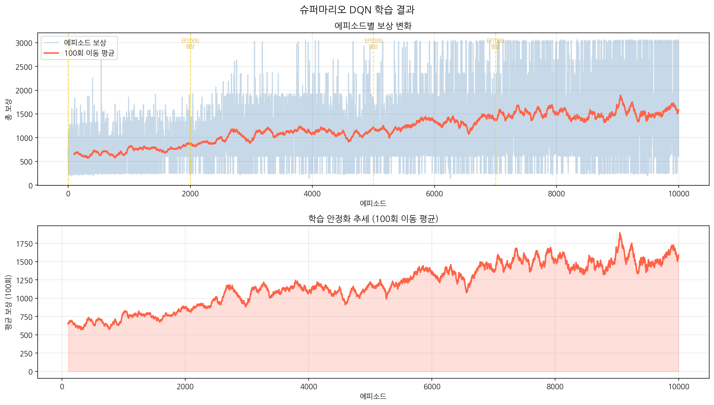

# 2026년도 슈퍼마리오 강화학습 과제
# AI개발 수행내역서

| 과제명 | DQN 에이전트를 활용한 슈퍼마리오 자율 플레이 학습 |
|---|---|
| 담당자 | 김승현 |

---

**2026년 6월 25일 ~ 2026년 7월 1일**

---

## AI개발 수행내용

**사업과제** : Deep Q-Network(DQN)으로 슈퍼마리오를 스스로 플레이하도록 강화학습

### 순서

① 프로젝트 개요  
② 데이터 수집  
③ 환경 구성 및 전처리 파이프라인  
④ DQN 모델 설계 및 학습 과정  
⑤ 에피소드별 성능 지표 및 결과 시각화  
⑥ Streamlit 시연 앱  
⑦ 결론 및 고찰  

---

## 1. 프로젝트 개요

### 1.1 추진배경 및 목적

- 강화학습(Reinforcement Learning)은 에이전트가 환경과 상호작용하며 보상 신호를 통해 스스로 최적의 행동 전략을 학습하는 머신러닝 패러다임이다.
- 슈퍼마리오는 명확한 보상 구조(전진 = 양의 보상, 시간 경과·사망 = 음의 보상)를 가져 강화학습 입문 과제로 널리 활용된다.
- 픽셀 단위 게임 화면을 CNN으로 인식하고 Deep Q-Network(DQN)으로 최적 행동을 학습하여, 마리오가 1-1 스테이지를 자율 플레이하는 에이전트를 구축한다.

### 1.2 과제 범위

| 과제구분 | 내용 |
|---|---|
| **AI** | **강화학습 환경 구성 (gym-super-mario-bros)** |
| | 게임 화면 전처리 (그레이스케일·리사이즈·프레임스택) |
| | CNN DQN 신경망 설계 및 학습 |
| | Experience Replay · Target Network · ε-greedy 적용 |
| | 에피소드별 보상 추이 및 영상 기록 |
| | Streamlit 시연 웹앱 구축 |

### 1.3 과제 추진 방법

#### 1) 환경 선정 기준

- OpenAI Gym 기반의 `gym-super-mario-bros` 라이브러리를 활용하여 표준화된 RL 환경에서 실험을 진행한다.
- SIMPLE_MOVEMENT 7가지 행동(정지·우이동·점프 등)으로 행동 공간을 제한하여 학습 난이도를 조정한다.
- Google Colab T4 GPU 환경에서 학습하여 GPU 가속을 활용한다.

#### 2) DQN 알고리즘 적용 대상

| 구분 | 입력 | 알고리즘 | 목표 |
|---|---|---|---|
| 슈퍼마리오 자율 플레이 | 게임 화면 픽셀 (4×84×84 흑백) | Deep Q-Network (DQN) | 1-1 스테이지 최대 거리 전진 |

#### 3) AI 분석모델 구축 프로세스

```
[환경 초기화]  →  [화면 전처리]    →  [데이터 수집]       →  [DQN 학습]       →  [평가]      →  [시연]
게임 시작          프레임 스킵(4)      ε-greedy 탐험          CNN Policy Net      에피소드별      Streamlit
SuperMarioBros     그레이스케일        경험 Replay Buffer      + Target Net        보상 추이       웹앱
1-1-v0             84×84 리사이즈      (s,a,r,s',done) 저장   + Replay Buffer      영상 기록
                   4프레임 스택
```

---

## 목차

| 섹션 | 내용 |
|---|---|
| [1. 프로젝트 개요](#1-프로젝트-개요) | 추진배경·과제 범위·추진 방법 |
| [2. 데이터 수집](#2-데이터-수집) | RL 데이터 생성 원리·ε-greedy·Replay Buffer |
| [3. 환경 구성 및 전처리 파이프라인](#3-환경-구성-및-전처리-파이프라인) | 행동 공간·전처리 단계·보상 구조 |
| [4. DQN 모델 설계 및 학습](#4-dqn-모델-설계-및-학습) | 신경망 구조·핵심 기법·하이퍼파라미터 |
| [5. 에피소드별 성능 지표 및 결과](#5-에피소드별-성능-지표-및-결과) | 학습 곡선·체크포인트 비교·영상 비교 |
| [6. Streamlit 시연 앱](#6-streamlit-시연-앱) | 4탭 구성·실행 방법 |
| [7. 결론 및 고찰](#7-결론-및-고찰) | 결과 요약·구현 산출물·한계점 |

---

## 연구개발 주요 결과물

## 2. 데이터 수집

강화학습에서의 데이터 수집은 지도학습과 근본적으로 다르다. 사전에 레이블된 데이터셋을 모으는 것이 아니라, **에이전트가 게임 환경과 직접 상호작용하면서 실시간으로 데이터를 생성**한다.

### 가. 수집 원리

```
에이전트 행동 선택 (ε-greedy)
       ↓
환경(슈퍼마리오) 실행
       ↓
(상태, 행동, 보상, 다음상태, 종료여부) 튜플 생성
       ↓
Experience Replay Buffer에 저장 (최대 50,000건)
```

| 구성요소 | 내용 | 형태 |
|---|---|---|
| **상태 (state)** | 현재 게임 화면 4프레임 스택 | (4, 84, 84) uint8 |
| **행동 (action)** | ε-greedy로 선택한 행동 인덱스 | 0~6 (7가지) |
| **보상 (reward)** | 환경이 반환하는 즉각 보상 | float (전진↑·사망↓) |
| **다음 상태 (next_state)** | 행동 후 변화된 화면 상태 | (4, 84, 84) uint8 |
| **종료 여부 (done)** | 에피소드 종료(사망·클리어·시간초과) | bool |

### 나. ε-greedy 탐험

데이터 다양성을 위해 **ε-greedy 정책**으로 탐험과 활용을 균형 있게 수행한다.

| 학습 단계 | ε 값 | 행동 방식 |
|---|---|---|
| 학습 초반 (EP 0~) | 1.0 (100%) | 완전 무작위 — 다양한 상황 탐험 |
| 학습 중반 | ~0.5 (50%) | 무작위 50% + 학습된 행동 50% |
| 학습 후반 (EP 5000~) | 0.1 (10%) | 주로 학습된 행동, 최소 탐험 유지 |

```python
# ε-greedy 행동 선택
if random.random() < epsilon:
    action = env.action_space.sample()  # 무작위 탐험
else:
    action = agent.act(state)           # 학습된 최적 행동

epsilon = max(epsilon_min, epsilon * epsilon_decay)  # 스텝마다 감소
```

### 다. Experience Replay Buffer

수집된 경험은 **Replay Buffer(최대 50,000건)**에 저장되며, 신경망 학습 시 랜덤 샘플링으로 사용된다.

```python
# 경험 저장
buffer.push(state, action, reward, next_state, done)

# 학습 시 랜덤 샘플링 (배치 크기 32)
batch = buffer.sample(batch_size=32)
```

**랜덤 샘플링의 효과:**
- 연속된 경험 간의 시간적 상관관계 제거 → 학습 안정화
- 다양한 게임 상황(초반·중반·장애물 앞)이 골고루 반영
- 드문 상황도 Buffer에 보존되어 반복 활용 가능

### 라. 데이터 수집과 학습의 동시 진행

강화학습에서 데이터 수집과 학습은 **하나의 학습 루프 안에서 동시에 진행**된다.

```
[에피소드 루프 — 총 10,000회]
  ① 게임 화면 관찰 → 전처리 (4×84×84 그레이스케일)
  ② ε-greedy로 행동 선택 (초반 무작위 → 후반 학습된 행동)
  ③ 환경 실행 → 보상 수신
  ④ 경험 (s, a, r, s', done) Replay Buffer 저장
  ⑤ Buffer에 32건 이상 쌓이면 → 랜덤 샘플링 → 신경망 학습
  ⑥ 1,000 스텝마다 Target Network 동기화
  ↑ 반복
```

별도의 데이터 수집 단계가 없으며, **게임 플레이 자체가 곧 학습 데이터**를 만들어 낸다. 보상 신호(전진 = 양수, 사망 = -25)가 지도학습의 레이블 역할을 대신한다.

---

## 3. 환경 구성 및 전처리 파이프라인

### 가. 강화학습 환경

○ **gym-super-mario-bros 7.4.0**
- 환경 ID: `SuperMarioBros-1-1-v0`
- 행동 공간: SIMPLE_MOVEMENT (7가지)
- 관측 공간: RGB 화면 (240×256×3)

### 나. 행동 공간 (SIMPLE_MOVEMENT, 7가지)

| 인덱스 | 행동 | 설명 |
|---|---|---|
| 0 | NOOP | 정지 |
| 1 | right | 오른쪽 이동 |
| 2 | right + A | 오른쪽 + 점프 |
| 3 | right + B | 오른쪽 + 달리기 |
| 4 | right + A + B | 오른쪽 + 달리기 + 점프 |
| 5 | left | 왼쪽 이동 |
| 6 | A | 제자리 점프 |

### 다. 전처리 파이프라인

전처리는 `src/env/wrappers.py`에 구현되어 있으며 다음 순서로 적용된다.

```
원본 화면 (RGB 240×256×3)
     ↓
[1] SkipFrame (skip=4)
    4프레임마다 한 번만 행동 결정 — 학습 속도 4배 향상, 보상 합산
     ↓
[2] GrayScaleObservation
    RGB(3채널) → 흑백(1채널) — 컬러 정보 제거로 연산량 감소
     ↓
[3] ResizeObservation (shape=84)
    240×256 → 84×84 — 신경망 입력 크기 통일
     ↓
[4] FrameStack (n_stack=4)
    연속 4프레임 누적 → (4, 84, 84) — 움직임 방향·속도 정보 포함
     ↓
최종 관측값: (4, 84, 84) uint8
```

### 라. 보상 구조 (`gym-super-mario-bros` 내장)

| 요소 | 보상값 | 설명 |
|---|---|---|
| x 위치 전진 | 양수 | 오른쪽으로 이동한 픽셀 비례 |
| x 위치 후퇴 | 음수 × 0.5 | 왼쪽 이동 페널티 (감쇠) |
| 시간 경과 | 음수 | 매 스텝 시간 페널티 |
| 사망 | -25 | 낙사·적 충돌 시 |
| 정지 | -0.5 | 이동 없을 때 소량 페널티 |

---

## 4. DQN 모델 설계 및 학습

### 가. 신경망 구조

```
입력: (4, 84, 84) — 4프레임 스택 그레이스케일

Conv2d(4 → 32,  kernel=8, stride=4) → ReLU   # 출력: (32, 20, 20)
Conv2d(32 → 64, kernel=4, stride=2) → ReLU   # 출력: (64, 9, 9)
Conv2d(64 → 64, kernel=3, stride=1) → ReLU   # 출력: (64, 7, 7)

Flatten(3136) → Linear(3136 → 512) → ReLU → Linear(512 → 7)

출력: 7개 행동의 Q값
```

### 나. DQN 핵심 기법

| 기법 | 구현 | 역할 |
|---|---|---|
| **Experience Replay** | `ReplayBuffer(50,000)` | 과거 경험 저장·랜덤 샘플링으로 상관관계 제거 |
| **Target Network** | 1,000 스텝마다 동기화 | 학습 안정화 — 목표 Q값 계산에 별도 네트워크 사용 |
| **ε-greedy** | 1.0 → 0.1 (decay=0.99999) | 탐험/활용 균형 — 학습 초반 무작위, 후반 최적 행동 |
| **Gradient Clipping** | max_norm=10 | 기울기 폭발 방지 |
| **Huber Loss** | SmoothL1Loss | MSE 대비 이상치에 강건한 손실함수 |

### 다. 하이퍼파라미터

| 파라미터 | 값 | 설명 |
|---|---|---|
| 학습률 (lr) | 0.0001 | Adam 옵티마이저 |
| 할인율 (γ) | 0.9 | 미래 보상 현재가치 환산 비율 |
| ε 시작 | 1.0 | 초기 100% 무작위 탐험 |
| ε 최솟값 | 0.1 | 최종 10% 탐험 유지 |
| ε 감소율 | 0.99999 | 스텝마다 곱함 |
| 배치 크기 | 32 | 1회 학습에 사용하는 경험 수 |
| Replay Buffer | 50,000 | 저장 경험 최대 수 |
| Target 업데이트 | 1,000 스텝 | Policy → Target 동기화 주기 |
| 프레임 스킵 | 4 | 동일 행동 반복 프레임 수 |

### 라. 학습 환경

| 항목 | 내용 |
|---|---|
| 플랫폼 | Google Colab |
| GPU | NVIDIA T4 |
| Python | 3.12 |
| PyTorch | 2.x (CUDA 12.x) |
| 총 에피소드 | 10,000 (500 에피소드마다 체크포인트 저장) |
| 영상·그래프 기록 시점 | EP 0 / 2000 / 5000 / 7000 / 10000 |
| 실시간 모니터링 | TensorBoard (보상·epsilon·학습 스텝) |

---

## 5. 에피소드별 성능 지표 및 결과

### 가. 에피소드별 학습 곡선

#### ○ EP 0 — 학습 전 (ε=1.0, 100% 무작위)



학습 전 무작위 에이전트의 베이스라인 보상. 랜덤 행동만 수행하며 진전 없음.

---

#### ○ EP 2000 — 초기 학습 단계



| 지표 | 값 |
|---|---|
| 최근 100회 평균 보상 | 860.7 |
| 최근 100회 최고 보상 | 1,904.0 |
| 최근 100회 최소 보상 | 234.0 |
| 현재 ε | 0.1000 |
| 총 학습 스텝 | 269,649 |
| 전체 최고 보상 | 2,874.0 |
| 전체 평균 보상 | 721.9 |

---

#### ○ EP 5000 — 중기 학습 단계



| 지표 | 값 |
|---|---|
| 최근 100회 평균 보상 | 1,222.6 |
| 최근 100회 최고 보상 | 2,916.0 |
| 최근 100회 최소 보상 | 241.0 |
| 현재 ε | 0.1000 |
| 총 학습 스텝 | 686,248 |
| 전체 최고 보상 | 3,059.0 |
| 전체 평균 보상 | 927.0 |

---

#### ○ EP 7000 — 후기 학습 단계



| 지표 | 값 |
|---|---|
| 최근 100회 평균 보상 | 1,387.2 |
| 최근 100회 최고 보상 | 3,047.0 |
| 최근 100회 최소 보상 | 232.0 |
| 현재 ε | 0.1000 |
| 총 학습 스텝 | 1,019,666 |
| 전체 최고 보상 | 3,059.0 |
| 전체 평균 보상 | 1,031.3 |

---

#### ○ EP 10000 — 최종 학습 결과



| 지표 | 값 |
|---|---|
| 최근 100회 평균 보상 | 1,590.0 |
| 최근 100회 최고 보상 | 3,059.0 |
| 최근 100회 최소 보상 | 233.0 |
| 현재 ε | 0.1000 |
| 총 학습 스텝 | 1,593,659 |
| 전체 최고 보상 | 3,062.0 |
| 전체 평균 보상 | 1,177.5 |

---

### 나. 체크포인트별 성능 비교

| 체크포인트 | 총 학습 스텝 | ε | 최근 100회 평균 보상 | 최근 100회 최고 보상 | 전체 최고 보상 | 전체 평균 보상 |
|:---:|---:|:---:|---:|---:|---:|---:|
| EP 0 | 0 | 1.0000 | 592.0 | 592.0 | 592.0 | 592.0 |
| EP 2000 | 269,649 | 0.1000 | 860.7 | 1,904.0 | 2,874.0 | 721.9 |
| EP 5000 | 686,248 | 0.1000 | 1,222.6 | 2,916.0 | 3,059.0 | 927.0 |
| EP 7000 | 1,019,666 | 0.1000 | 1,387.2 | 3,047.0 | 3,059.0 | 1,031.3 |
| EP 10000 | 1,593,659 | 0.1000 | 1,590.0 | 3,059.0 | 3,062.0 | 1,177.5 |

**주요 관찰:**
- ε은 EP 2000 이전(약 230,000 스텝)에 이미 최솟값 0.1에 도달 — 이후 전 구간 활용(exploitation) 위주로 학습
- 100회 이동 평균 보상이 EP 0(592) → EP 10000(1,590)으로 약 **2.7배** 향상
- **EP 9000에서 슈퍼마리오 1-1 스테이지 클리어 달성** — 픽셀 입력 기반 DQN 에이전트가 무작위 행동에서 출발하여 스테이지를 완주하는 목표를 달성하였다.

---

### 다. 전체 학습 곡선 (EP 0 ~ EP 10000)



EP 0부터 EP 10000까지의 전체 보상 변화 및 100회 이동 평균을 나타낸 그래프다. 이동 평균이 꾸준히 우상향하며, EP 9000 구간에서 스테이지 클리어를 달성하였다. 학습 초반 무작위 행동 단계에서 시작하여 점진적으로 전진 전략과 장애물 회피를 익히는 과정이 보상 증가 추이로 확인된다.

### 라. 에피소드별 플레이 영상 비교

| 에피소드 | 파일 | 특징 |
|---|---|---|
| EP 0 | `gif/mario_ep0000.gif` | 100% 무작위 행동 — 제자리 또는 역방향 이동 |
| EP 2000 | `gif/mario_ep2000.gif` | 우측 전진 행동 학습 시작 |
| EP 5000 | `gif/mario_ep5000.gif` | 장애물 회피 패턴 등장 |
| EP 7000 | `gif/mario_ep7000.gif` | 후기 학습 — 전진 전략 고도화 |
| EP 10000 | `gif/mario_ep10000.gif` | 최종 학습 결과 — EP 9000 클리어 이후 학습 지속 |

---

## 6. Streamlit 시연 앱

### 탭 구성 (4탭)

| 탭 | 내용 |
|---|---|
| 🎮 **시연** | 학습된 모델 선택 → 에이전트 실시간 플레이 영상 생성 |
| 🎬 **에피소드 비교** | EP 0/2000/5000/7000/10000 플레이 영상 나란히 비교 |
| 📈 **학습 곡선** | 에피소드별 보상 변화 + 이동 평균 그래프 |
| 🧠 **모델 구조** | CNN 신경망 구조 + 하이퍼파라미터 요약 |

### 실행 방법

```bash
streamlit run app/streamlit_app.py
```

---

## 7. 결론 및 고찰

### 가. 학습 결과 요약

총 10,000 에피소드(1,593,659 스텝) 학습을 완료하였으며, **EP 9000에서 슈퍼마리오 1-1 스테이지 클리어를 달성**하였다.

DQN 에이전트는 학습 초반 완전 무작위 행동에서 출발하여, EP 2000 무렵 우측 전진 패턴을 습득하고, EP 5000 이후 장애물 회피 및 점프 타이밍을 학습하였다. EP 7000~9000 구간에서 전략이 정교화되며 결국 스테이지 완주에 성공하였다.

픽셀(84×84 흑백 화면) 단 하나의 입력만으로, 별도의 사전 지식 없이 보상 신호만을 통해 스테이지를 클리어하는 에이전트를 구축했다는 점에서 DQN 강화학습의 유효성을 실험적으로 확인하였다.

### 나. 구현 산출물 현황

| 구분 | 파일 | 내용 |
|---|---|---|
| 환경 전처리 | `src/env/wrappers.py` | SkipFrame · GrayScale · Resize · FrameStack |
| 신경망 | `src/model/dqn.py` | CNN DQN (Conv×3 + FC×2) |
| 에이전트 | `src/agent/dqn_agent.py` | ε-greedy · Replay · Target Net · 저장/로드 |
| 버퍼 | `src/utils/replay_buffer.py` | Experience Replay Buffer (deque 기반) |
| 녹화 | `src/utils/recorder.py` | 에피소드 플레이 MP4 녹화 (2배속·30초) |
| 학습 노트북 | `colab/train.ipynb` | Colab T4 GPU 학습 + TensorBoard + 체크포인트 그래프 자동 저장 |
| 시연 앱 | `app/streamlit_app.py` | 4탭 Streamlit 웹앱 |

### 다. 향후 발전 방향

본 과제에서는 Vanilla DQN으로 1-1 스테이지 클리어를 달성하였다. 아래 개선 기법을 적용하면 학습 효율을 높이고, 다른 스테이지로의 확장도 가능할 것으로 판단된다.

| 기법 | 기대 효과 |
|---|---|
| **Double DQN** | 행동 선택(policy_net)과 Q값 평가(target_net)를 분리 → Q값 과대추정 억제, 학습 안정화 |
| **Prioritized Experience Replay** | TD 오차가 큰 중요 경험에 높은 샘플링 확률 부여 → 샘플 효율 향상 |
| **Dueling DQN** | 상태 가치(V)와 행동 이점(A)을 분리 추정 → 행동 무관 상황 학습 안정화 |
| **다중 스테이지 학습** | 1-2, 1-3 등 추가 스테이지 학습 → 다양한 맵 환경에 대한 일반화 능력 확장 |
